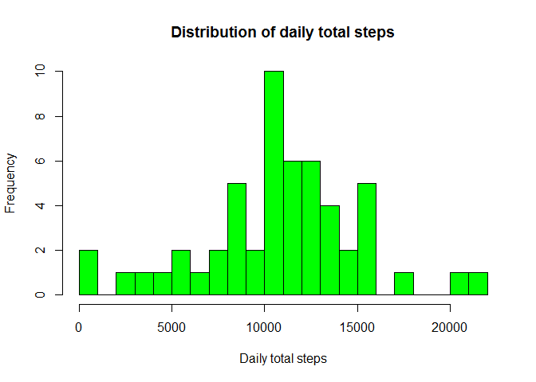
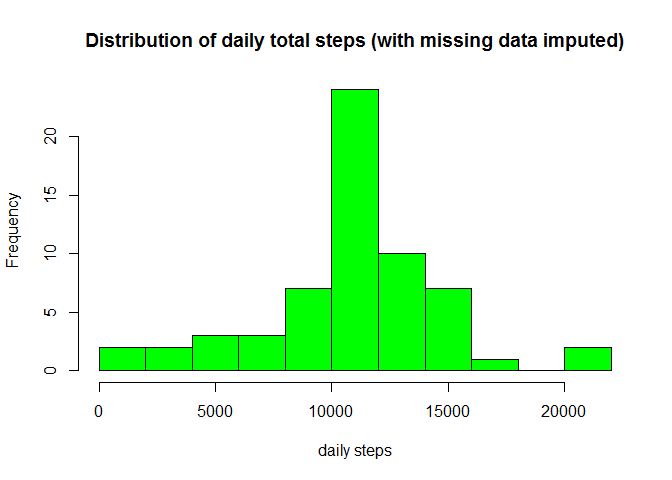

# Reproducible Research: Peer Assessment 1


## Loading and preprocessing the data
For this assignment, the first step is to load the data file “activity.csv” by read.csv


```r
cls = c("integer", "character", "integer")
mydata <- read.csv("activity.csv", head=TRUE, colClasses=cls, na.strings="NA")
head(mydata)
```

```
##   steps       date interval
## 1    NA 2012-10-01        0
## 2    NA 2012-10-01        5
## 3    NA 2012-10-01       10
## 4    NA 2012-10-01       15
## 5    NA 2012-10-01       20
## 6    NA 2012-10-01       25
```

Then we process/transform the data set for later analysis. In particular, the type of date column is corrected, as well as getting rid of rows containing missing values and save the subset to a new data frame “mydata2”. The original data frame is kept for later data imputation.


```r
mydata$date <- as.Date(mydata$date)
mydata2 <- subset(mydata, !is.na(mydata$steps))
```

## What is mean total number of steps taken per day?
Next, a histogram of the daily total number of steps taken is generated, showing the distribution of these totals.


```r
dailysum <- tapply(mydata2$steps, mydata2$date, sum, na.rm=TRUE, simplify=T)
dailysum <- dailysum[!is.na(dailysum)]
hist(dailysum, col="green", breaks=20, xlab="Daily total steps",main="Distribution of daily total steps")
```

 

Then,calculate the mean and median total number of steps taken per day as follows.


```r
mean(dailysum); median(dailysum)
```

```
## [1] 10766.19
```

```
## [1] 10765
```

Therefore the mean is 1.077e+04 steps and the median is 1.077e+04 steps.

## What is the average daily activity pattern?
Here we create a time series plot of the 5-minute interval (x-axis) against the average number of steps taken, averaged across all days (y-axis) in order to exam the average daily activity pattern.


```r
int_ave <- tapply(mydata2$steps, mydata2$interval, mean, na.rm=TRUE)
df_int_ave <- data.frame(interval=as.integer(names(int_ave)), ave=int_ave)

plot(df_int_ave$interval, df_int_ave$ave, type="l",xlab="5-minute intervals",
          ylab="average steps in the interval across all days")
```

 

The next thing is to find which 5-minute interval contains the maximum number of steps:


```r
step_max <- max(df_int_ave$ave)
df_int_ave[df_int_ave$ave==step_max,]
```

```
##     interval      ave
## 835      835 206.1698
```

It turns out that the interval 835 contains maximum number of steps 206.2.

## Imputing missing values
First, calculate the total number of missing values in the dataset:


```r
sum(is.na(mydata$steps))
```

```
## [1] 2304
```

So, the original data contains 2304 rows with missing data.

For filling in the missing values in the data set, we use a simple strategy which replaces the mean for that 5-minute interval with every missing value.
We create a new data frame "mydata3"" that is equal to the original dataset but with the missing data filled in (using mean for that interval for imputation):


```r
mydata3 <- mydata
ndx <- is.na(mydata3$steps)
int_ave <- tapply(mydata2$steps, mydata2$interval, mean, na.rm=TRUE, simplify=T)
mydata3$steps[ndx] <- int_ave[as.character(mydata3$interval[ndx])]
```

Below is a histogram of the total number of steps taken each day.


```r
dailysum2 <- tapply(mydata3$steps, mydata3$date, sum, na.rm=TRUE, simplify=T)

hist(x=dailysum2, col="green", breaks=10, xlab="daily steps",
     main="Distribution of daily total steps (with missing data imputed)")
```

 

In addition, the mean and median for the new data set are calculated as follows:

```r
mean(dailysum2); median(dailysum2)
```

```
## [1] 10766.19
```

```
## [1] 10766.19
```

Compared to the result of the original data set, we cannot see any difference in the mean whereas there is a small increase in the median. Actually, the new median becomes identical to the mean. One possible explanation would be that when we fill the missing data for the intervals, we use means for intervals, so we have more data close or identical to the means, and median is shifted and becomes identical to the mean.

## Are there differences in activity patterns between weekdays and weekends?
First create a new factor variable “wk” in the dataset with two levels - “weekday” and “weekend”.


```r
# helper function to decide if a day is a week day or not
is_weekday <- function(d) {
    wd <- weekdays(d)
    ifelse (wd == "土曜日" | wd == "日曜日", "weekend", "weekday")
}

wx <- sapply(mydata3$date, is_weekday)
mydata3$wk <- as.factor(wx)
head(mydata3)
```

```
##       steps       date interval      wk
## 1 1.7169811 2012-10-01        0 weekday
## 2 0.3396226 2012-10-01        5 weekday
## 3 0.1320755 2012-10-01       10 weekday
## 4 0.1509434 2012-10-01       15 weekday
## 5 0.0754717 2012-10-01       20 weekday
## 6 2.0943396 2012-10-01       25 weekday
```

Next we make a panel plot containing a time series plot (i.e. type = “l”) of the 5-minute interval (x-axis) and the average number of steps taken, averaged across all weekday days or weekend days (y-axis).


```r
wk_df <- aggregate(steps ~ wk+interval, data=mydata3, FUN=mean)

library(lattice)
xyplot(steps ~ interval | factor(wk), layout = c(1, 2), xlab="Interval", ylab="Number of steps", type="l", lty=1,   data=wk_df)
```

 

From the panel plot it looks like the weekday activities arise earlier (around 5~6am) than the weekends (around 8am). We can also observe that from 10am to 5pm, the weekends have higher activity levels than the weekdays.
